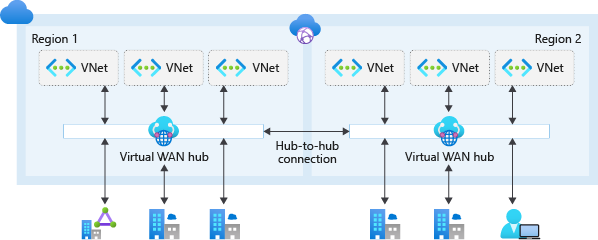

<!-- BEGIN_TF_DOCS -->
# ALZ.Connectivity

This project deploys Azure Connectivity resources with an Azure Virtual WAN network topology into an existing subscription (Connectivity Subscription within the Platform Management Group) that has been created as part of the Enterprise Scale Core Management Group deployment.

Azure Virtual WAN is a Microsoft-managed solution that provides end-to-end, global, and dynamic transit connectivity by default. Virtual WAN hubs eliminate the need to manually configure network connectivity. For example, you don't need to manage user-defined routes (UDR) or network virtual appliances (NVAs) to enable global transit connectivity. Virtual WAN simplifies end-to-end network connectivity in Azure, and to Azure from on-premises, by creating a hub-and-spoke network architecture. The architecture can easily scale to support multiple Azure regions and on-premises locations (any-to-any connectivity) as shown below:



## Updating Docs

The `terraform-docs` utility is used to generate this README. Follow the below steps to update:
1. Make changes to the `.terraform-docs.yml` file
2. Fetch the `terraform-docs` binary (https://terraform-docs.io/user-guide/installation/)
3. Run `terraform-docs markdown table --output-file ${PWD}/README.md --output-mode inject terraform/`

## Custom Route Tables

In certain cases there may be a requirement where a Landing Zone requires the use of a custom defined route table with specific routes. This is supported by defining a Virtual Hub Route Table within this repository, which can then be referenced in the vnet configuration for a Landing Zone. Steps are outlined below:
1. Modify the `settings.route-tables.tf` file to add a new Hub Route Table, for example:
```hcl
locals {
  route_tables = {
    "Example_Route_Table_1" = {       # The name of the Virtual Hub Route Table - Cannot contain spaces
      location = var.primary_location # Used to associate with the Virtual Hub in the same location
      labels = [
        "ExampleHubRouteTable" # Optional list of labels
      ]
      routes = {
        "Main" = {                                                          # The name of the Route
          destinations      = ["10.0.0.0/8"]                                # A list of destinations
          destinations_type = "CIDR"                                        # The destination type (also supports 'ResourceId' and 'Service')
          next_hop          = local.vwan_firewall_ids[var.primary_location] # The ResourceId of the next hop
        }
      }
    }
  }
}
```
2. Merge and apply the changes.
3. Re-run the `ALZ.Core` Pipeline, which will update the `output.custom_route_tables` output.
4. Within `ALZ.LandingZones.<LZ-Type>`, update the `virtual_networks` configuration for a Landing Zone to point to the newly created Hub Route Table:
```hcl
virtual_networks = {
  main = {
    address_space = {
      dev = ["10.30.7.0/28"]
      pre = ["10.30.7.16/28"]
      prd = ["10.30.7.32/28"]
    }
    vwan_associated_routetable_resource_id = {
      dev = data.terraform_remote_state.core.outputs.custom_route_tables["Example_Route_Table_1"]
      pre = data.terraform_remote_state.core.outputs.custom_route_tables["Example_Route_Table_1"]
      prd = data.terraform_remote_state.core.outputs.custom_route_tables["Example_Route_Table_1"]
    }
  }
}
```
5. Run the related Landing Zones pipeline to apply changes.

## Inputs

| Name | Description | Type | Default | Required |
|------|-------------|------|---------|:--------:|
| <a name="input_connectivity_resources_tags"></a> [connectivity\_resources\_tags](#input\_connectivity\_resources\_tags) | Set tags to apply to the Resource Group | `map(string)` | <pre>{<br>  "BusinessCriticality": "Mission-critical",<br>  "BusinessUnit": "Platform Operations",<br>  "DataClassification": "General",<br>  "OperationsTeam": "Platform Operations",<br>  "WorkloadName": "ALZ.Connectivity"<br>}</pre> | no |
| <a name="input_environment"></a> [environment](#input\_environment) | Sets the environment to deploy the resources into | `string` | n/a | yes |
| <a name="input_firewall_config_storage_account_name"></a> [firewall\_config\_storage\_account\_name](#input\_firewall\_config\_storage\_account\_name) | Sets the name of the storage account to retrieve the firewall configuration from | `string` | n/a | yes |
| <a name="input_management_storage_account_name"></a> [management\_storage\_account\_name](#input\_management\_storage\_account\_name) | Sets the name of the storage account to retrieve the management configuration from | `string` | n/a | yes |
| <a name="input_primary_location"></a> [primary\_location](#input\_primary\_location) | Sets the location for "primary" resources to be created in. | `string` | `"uksouth"` | no |
| <a name="input_primary_location_cidr"></a> [primary\_location\_cidr](#input\_primary\_location\_cidr) | Sets the address prefix for the primary location | `string` | `"172.28.0.0/23"` | no |
| <a name="input_root_id"></a> [root\_id](#input\_root\_id) | Sets the value used for generating unique resource naming within the module. | `string` | `"alz"` | no |
| <a name="input_secondary_location"></a> [secondary\_location](#input\_secondary\_location) | Sets the location for "secondary" resources to be created in. | `string` | `"ukwest"` | no |
| <a name="input_secondary_location_cidr"></a> [secondary\_location\_cidr](#input\_secondary\_location\_cidr) | Sets the address prefix for the secondary location | `string` | `"172.28.128.0/23"` | no |

## Outputs

| Name | Description |
|------|-------------|
| <a name="output_azurerm_firewall_ids"></a> [azurerm\_firewall\_ids](#output\_azurerm\_firewall\_ids) | Returns a Map of Location => ID for all Azure Firewalls that have been created. |
| <a name="output_azurerm_private_dns_zone"></a> [azurerm\_private\_dns\_zone](#output\_azurerm\_private\_dns\_zone) | Returns the Private DNS Zones that has been created. |
| <a name="output_azurerm_virtual_hub_ids"></a> [azurerm\_virtual\_hub\_ids](#output\_azurerm\_virtual\_hub\_ids) | Returns a Map of Location => ID for all Virtual Hubs that have been created. |
| <a name="output_configuration"></a> [configuration](#output\_configuration) | Configuration settings for the "connectivity" resources. |
| <a name="output_custom_route_tables"></a> [custom\_route\_tables](#output\_custom\_route\_tables) | Returns the IDs of all custom route tables that have been created. |
| <a name="output_subscription_id"></a> [subscription\_id](#output\_subscription\_id) | Subscription ID for the "connectivity" resources. |
<!-- END_TF_DOCS -->